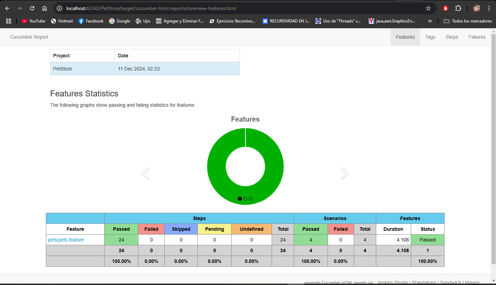

# Ejercicio de Automatización de API con **KARATE**

## Funcionalidades
Este proyecto realiza pruebas funcionales automatizadas utilizando de servicios REST, realizar las siguientes pruebas, identificando las entradas, capturando las salidas, test, variables, etc, en cada uno de los siguientes casos:

* Añadir una mascota a la tienda
* Consultar la mascota ingresada previamente (Búsqueda por ID)
* Actualizar el nombre de la mascota y el estatus de la mascota a “sold”
* Consultar la mascota modificada por estatus (Búsqueda por estatus)
  
## Requisitos
* **IntelliJ IDEA 2023.3.3**
* **JDK 17:** Verificar Java en las variables de entorno.
* **Maven 3.9.9:** Importante que tengan Maven en las variables de entorno.
* **Karate:** se instalará automáticamente al ejecutar el proyecto junto a otras dependencias necesarias, estas se encuentran en el pom.xml

## Plugins necesarios en el IDE
* Cucumber for Java
* Gherkin

## Instalación y Ejecución
* Clonar el repositorio en la máquina local: git clone https://github.com/YOUR-USERNAME/YOUR-REPOSITORY.
* Verificar dependencias en el pom.xml
* Abrir el archivo 'RunnersMain' de la ruta "/src/test/java/pets"
* Click sobre 'Run' en la clase 'RunnerMain'

## Reporte
El reporte se encuentra en la **ruta:** target/cucumber-html-reports/overview-features.html, el cual permite tener un informe detallado de las pruebas automatizadas y su estado final.

## Reporte PDF
[Ver el documento PDF](docs/ReportePets.pdf)

# CONCLUSIONES

A lo largo de la resolución de este ejercicio, he podido confirmar que Karate es un framework que ofrece diversas ventajas para la automatización de pruebas. Entre sus principales fortalezas se destacan su capacidad para escribir múltiples casos de prueba en diferentes escenarios, lo que facilita la cobertura de diversas condiciones en un solo conjunto de pruebas. Además, la posibilidad de crear variables en el background y reutilizarlas en distintos escenarios mejora la eficiencia y la claridad del código de las pruebas.

Una de las grandes ventajas de Karate es que su programación es relativamente sencilla, especialmente en comparación con otros frameworks más complejos como JMeter, lo que facilita su adopción por parte de equipos con distintos niveles de experiencia. También cabe resaltar que la ejecución de los escenarios fue extremadamente rápida, sin la necesidad de largos tiempos de espera, algo común en las automatizaciones web tradicionales.

En resumen, Karate se presenta como una herramienta poderosa y accesible para la automatización de pruebas, ofreciendo una combinación de simplicidad, rapidez y eficiencia que lo convierte en una excelente opción para equipos que buscan optimizar sus procesos de prueba sin complicaciones innecesarias.
